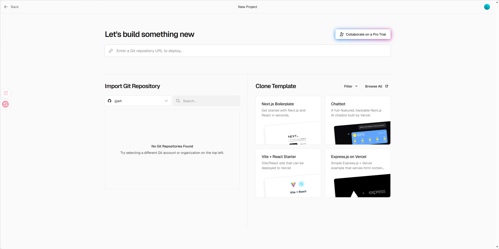

# Deployment Guide for Immersive Narrative Vue

## 1. Local Development Verification

Ensure your application is running correctly locally before deploying.

- **Start Server**: `npm run dev`
- **Check Port**: Ensure port `5173` is accessible.
- **Access**: Open `http://localhost:5173`.

## 2. Production Build

Build the application for production to generate optimized static files.

```bash
npm run build
```

The output will be in the `dist/` directory.

## 3. Deploy to Vercel (Recommended)

Vercel is the easiest way to deploy Vue applications.

1.  **Push to GitHub**:
    - Initialize Git: `git init`
    - Add files: `git add .`
    - Commit: `git commit -m "Initial commit"`
    - Create a repository on GitHub and push your code.

2.  **Import to Vercel**:
    - Go to [Vercel Dashboard](https://vercel.com/dashboard).
    - Click **"Add New..."** -> **"Project"**.
    - Import your GitHub repository.

3.  **Configure**:
    - **Framework Preset**: Vite
    - **Root Directory**: `.` (default)
    - **Build Command**: `npm run build` (default)
    - **Output Directory**: `dist` (default)
    - **Environment Variables**: Add any if needed.

4.  **Deploy**: Click **"Deploy"**. Vercel will automatically build and deploy your site.

## 4. Deploy to Netlify (Alternative)

1.  **Push to GitHub**.
2.  **Log in to Netlify**.
3.  **"Add new site"** -> **"Import an existing project"**.
4.  **Select GitHub** and choose your repo.
5.  **Build Settings**:
    - **Build command**: `npm run build`
    - **Publish directory**: `dist`
6.  **Deploy site**.

## 5. Custom Domain & HTTPS

Both Vercel and Netlify provide free SSL (HTTPS) automatically.

- **Vercel**: Go to Project Settings -> Domains -> Add your custom domain. Follow DNS configuration instructions (usually adding a CNAME record).
- **Netlify**: Go to Site settings -> Domain management -> Add custom domain.

## 6. CI/CD Pipeline

Both Vercel and Netlify have built-in CI/CD.
- Every time you push to the `main` branch, a new deployment will be triggered automatically.
- Pull Requests will generate Preview Deployments.

## 7. Verification & Monitoring

- **Status Check**: Verify the site returns HTTP 200.
- **Performance**: Run Lighthouse in Chrome DevTools or use PageSpeed Insights.
- **Analytics**: Enable Vercel Analytics or Netlify Analytics for visitor stats.

## 8. Manual/Static Hosting (e.g., Nginx/Apache)

If you prefer your own server:

1.  **Build**: `npm run build`
2.  **Upload**: Copy the contents of `dist/` to your server's web root (e.g., `/var/www/html`).
3.  **Configure Web Server**:
    - Ensure it serves `index.html` for SPA routing (fallback to index.html for 404s).
    - **Nginx Example**:
      ```nginx
      server {
          listen 80;
          server_name yourdomain.com;
          root /var/www/html;
          index index.html;
          location / {
              try_files $uri $uri/ /index.html;
          }
      }
      ```
